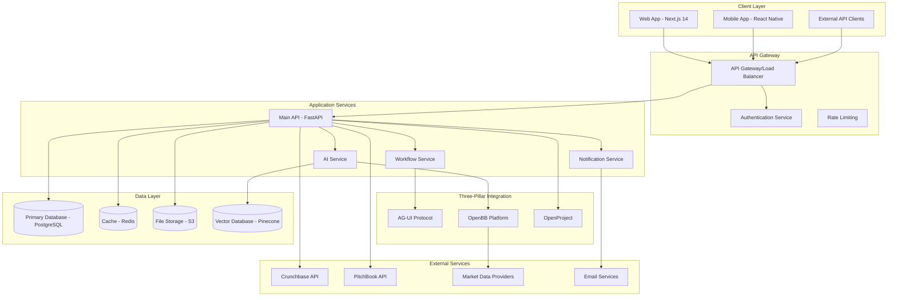

# RedPill VC Platform - Technical Architecture Guide

**Version:** 2.0  
**Date:** January 29, 2025  
**Engineering Team:** RedPill Engineering  
**Status:** Active  

## Overview

This document defines the technical architecture for the RedPill VC platform, built on a three-pillar foundation that integrates AI agents, financial data, and portfolio management into a unified, scalable system.

---

## 1. Architecture Overview

### 1.1 High-Level Architecture



### 1.2 Technology Stack

#### Frontend Stack
```yaml
Framework: Next.js 14 (App Router)
Language: TypeScript 5.0+
Styling: Tailwind CSS + shadcn/ui
State Management: Zustand + React Query
Real-time: WebSockets + Server-Sent Events
Testing: Jest + React Testing Library + Playwright
```

#### Backend Stack
```yaml
API Framework: FastAPI 0.104+
Language: Python 3.11+
Database: PostgreSQL 15+ with SQLModel ORM
Cache: Redis 7.0+
Message Queue: Celery with Redis broker
File Storage: AWS S3 + CloudFront CDN
Search: Elasticsearch 8.0+
```

#### Infrastructure
```yaml
Container Platform: Docker + Kubernetes
Cloud Provider: AWS (primary) + Multi-cloud support
Monitoring: DataDog + Prometheus + Grafana
Logging: Structured logging with ELK stack
CI/CD: GitHub Actions + ArgoCD
Security: AWS IAM + Vault for secrets
```

---

## 2. Three-Pillar Architecture Deep Dive

### 2.1 AG-UI Protocol Integration

#### Purpose
Provides standardized AI agent communication for real-time, interactive AI experiences throughout the platform.

#### Implementation
```python
# AG-UI Client Implementation
from agui import AGUIClient, MessageType

class RedPillAIAgent:
    def __init__(self):
        self.client = AGUIClient(
            agent_id="redpill-ai",
            capabilities=["financial_analysis", "deal_research", "portfolio_insights"]
        )
    
    async def handle_user_query(self, query: str, context: dict):
        # Stream response with real-time updates
        async for event in self.client.stream_response(
            message=query,
            context=context,
            tools=["openbb_data", "crunchbase_search", "portfolio_analysis"]
        ):
            if event.type == MessageType.TOOL_CALL_START:
                yield {"type": "tool_start", "tool": event.tool_name}
            elif event.type == MessageType.TEXT_MESSAGE_CONTENT:
                yield {"type": "text_delta", "content": event.content}
            elif event.type == MessageType.STATE_DELTA:
                yield {"type": "state_update", "state": event.state}
```

#### WebSocket Integration
```typescript
// Frontend AG-UI integration
export class AGUIWebSocketClient {
  private ws: WebSocket;
  private eventHandlers: Map<string, (event: AGUIEvent) => void>;

  async connectToAgent(agentId: string, context: any) {
    this.ws = new WebSocket(`wss://api.redpill.vc/ai/agents/${agentId}/stream`);
    
    this.ws.onmessage = (message) => {
      const event = JSON.parse(message.data) as AGUIEvent;
      
      switch (event.type) {
        case 'TEXT_MESSAGE_CONTENT':
          this.handleTextDelta(event);
          break;
        case 'TOOL_CALL_START':
          this.handleToolStart(event);
          break;
        case 'STATE_DELTA':
          this.handleStateUpdate(event);
          break;
      }
    };
  }

  private handleTextDelta(event: AGUIEvent) {
    // Update UI with streaming text
    this.eventHandlers.get('text_delta')?.(event);
  }
}
```

### 2.2 OpenBB Platform Integration

#### Purpose
Provides comprehensive financial data, market analytics, and economic indicators for investment research and portfolio analysis.

#### Data Sources Integration
```python
# OpenBB Service Implementation
from openbb import obb
import asyncio
from typing import Dict, List, Any

class OpenBBService:
    def __init__(self):
        # Configure OpenBB with API keys
        obb.account.login()
    
    async def get_company_fundamentals(self, ticker: str) -> Dict[str, Any]:
        """Get comprehensive company financial data"""
        try:
            # Parallel data fetching
            tasks = [
                obb.equity.fundamental.overview(symbol=ticker),
                obb.equity.fundamental.income(symbol=ticker, period="annual", limit=5),
                obb.equity.fundamental.balance(symbol=ticker, period="annual", limit=5),
                obb.equity.fundamental.cash(symbol=ticker, period="annual", limit=5),
                obb.equity.fundamental.ratios(symbol=ticker, period="annual", limit=5)
            ]
            
            results = await asyncio.gather(*tasks, return_exceptions=True)
            
            return {
                "overview": results[0],
                "income_statements": results[1],
                "balance_sheets": results[2],
                "cash_flows": results[3],
                "financial_ratios": results[4]
            }
        except Exception as e:
            logger.error(f"Error fetching fundamentals for {ticker}: {e}")
            return {}
    
    async def get_market_data(self, symbols: List[str]) -> Dict[str, Any]:
        """Get real-time market data for multiple symbols"""
        market_data = {}
        
        for symbol in symbols:
            try:
                quote = await obb.equity.price.quote(symbol=symbol)
                historical = await obb.equity.price.historical(
                    symbol=symbol, 
                    period="1y"
                )
                
                market_data[symbol] = {
                    "quote": quote,
                    "historical": historical,
                    "last_updated": datetime.utcnow()
                }
            except Exception as e:
                logger.error(f"Error fetching market data for {symbol}: {e}")
                market_data[symbol] = {"error": str(e)}
        
        return market_data
    
    async def analyze_portfolio_performance(self, holdings: List[Dict]) -> Dict[str, Any]:
        """Analyze portfolio performance metrics"""
        symbols = [holding["symbol"] for holding in holdings]
        market_data = await self.get_market_data(symbols)
        
        # Calculate portfolio metrics
        total_value = 0
        total_cost_basis = 0
        sector_allocation = {}
        
        for holding in holdings:
            symbol = holding["symbol"]
            shares = holding["shares"]
            cost_basis = holding["cost_basis"]
            
            if symbol in market_data and "quote" in market_data[symbol]:
                current_price = market_data[symbol]["quote"]["price"]
                current_value = shares * current_price
                
                total_value += current_value
                total_cost_basis += cost_basis
                
                # Sector allocation
                sector = market_data[symbol]["quote"].get("sector", "Unknown")
                sector_allocation[sector] = sector_allocation.get(sector, 0) + current_value
        
        return {
            "total_value": total_value,
            "total_return": total_value - total_cost_basis,
            "total_return_percentage": (total_value - total_cost_basis) / total_cost_basis * 100,
            "sector_allocation": sector_allocation,
            "last_updated": datetime.utcnow()
        }
```

#### Caching Strategy
```python
# Redis caching for OpenBB data
import redis
import json
from datetime import timedelta

class OpenBBCache:
    def __init__(self, redis_client: redis.Redis):
        self.redis = redis_client
        
    async def get_cached_data(self, cache_key: str) -> Optional[Dict]:
        """Get cached OpenBB data"""
        cached = await self.redis.get(cache_key)
        if cached:
            return json.loads(cached)
        return None
    
    async def cache_data(self, cache_key: str, data: Dict, ttl: int = 3600):
        """Cache OpenBB data with TTL"""
        await self.redis.setex(
            cache_key, 
            ttl, 
            json.dumps(data, default=str)
        )
    
    def get_cache_key(self, data_type: str, symbol: str, **kwargs) -> str:
        """Generate consistent cache keys"""
        params = "_".join([f"{k}:{v}" for k, v in sorted(kwargs.items())])
        return f"openbb:{data_type}:{symbol}:{params}"
```

### 2.3 OpenProject Integration

#### Purpose
Manages portfolio projects, deal workflows, and team collaboration within the VC process.

#### Project Management Integration
```python
# OpenProject API Integration
import httpx
from typing import List, Dict, Optional

class OpenProjectService:
    def __init__(self, base_url: str, api_key: str):
        self.base_url = base_url
        self.headers = {
            "Authorization": f"Basic {api_key}",
            "Content-Type": "application/json"
        }
    
    async def create_deal_project(self, deal_data: Dict) -> Dict:
        """Create a new project for a deal"""
        project_data = {
            "name": f"{deal_data['company_name']} - {deal_data['round_type']}",
            "description": f"Due diligence and investment tracking for {deal_data['company_name']}",
            "status": {"name": "Active"},
            "type": {"name": "Investment Deal"},
            "customFields": {
                "company": deal_data["company_name"],
                "sector": deal_data.get("sector"),
                "stage": deal_data.get("stage"),
                "investment_amount": deal_data.get("investment_amount"),
                "valuation": deal_data.get("valuation")
            }
        }
        
        async with httpx.AsyncClient() as client:
            response = await client.post(
                f"{self.base_url}/api/v3/projects",
                headers=self.headers,
                json=project_data
            )
            
            if response.status_code == 201:
                project = response.json()
                await self.setup_deal_workflow(project["id"], deal_data)
                return project
            else:
                raise HTTPException(
                    status_code=response.status_code,
                    detail=f"Failed to create project: {response.text}"
                )
    
    async def setup_deal_workflow(self, project_id: str, deal_data: Dict):
        """Set up standard VC deal workflow"""
        workflow_phases = [
            {"name": "Initial Screening", "duration": 7, "type": "phase"},
            {"name": "Partner Review", "duration": 14, "type": "milestone"},
            {"name": "Due Diligence", "duration": 30, "type": "phase"},
            {"name": "Investment Committee", "duration": 7, "type": "milestone"},
            {"name": "Term Sheet Negotiation", "duration": 14, "type": "phase"},
            {"name": "Legal & Closing", "duration": 21, "type": "phase"}
        ]
        
        for i, phase in enumerate(workflow_phases):
            work_package_data = {
                "subject": phase["name"],
                "type": {"name": phase["type"].title()},
                "status": {"name": "New"},
                "priority": {"name": "High" if phase["type"] == "milestone" else "Normal"},
                "estimatedTime": f"P{phase['duration']}D",
                "project": {"href": f"/api/v3/projects/{project_id}"}
            }
            
            # Set dependencies
            if i > 0:
                work_package_data["precedes"] = [{"href": f"/api/v3/work_packages/{i}"}]
            
            await self.create_work_package(project_id, work_package_data)
    
    async def update_deal_status(self, project_id: str, status: str, notes: str = ""):
        """Update deal project status"""
        update_data = {
            "status": {"name": status},
            "description": {"raw": notes} if notes else None
        }
        
        async with httpx.AsyncClient() as client:
            response = await client.patch(
                f"{self.base_url}/api/v3/projects/{project_id}",
                headers=self.headers,
                json=update_data
            )
            
            return response.json() if response.status_code == 200 else None
```

---

## 3. Database Architecture

### 3.1 PostgreSQL Schema Design

#### Core Tables
```sql
-- Fund management
CREATE TABLE funds (
    id UUID PRIMARY KEY DEFAULT gen_random_uuid(),
    name VARCHAR(255) NOT NULL,
    fund_size DECIMAL(15,2),
    vintage_year INTEGER,
    status VARCHAR(50) DEFAULT 'Active',
    created_at TIMESTAMP DEFAULT CURRENT_TIMESTAMP,
    updated_at TIMESTAMP DEFAULT CURRENT_TIMESTAMP
);

-- Portfolio companies
CREATE TABLE companies (
    id UUID PRIMARY KEY DEFAULT gen_random_uuid(),
    name VARCHAR(255) NOT NULL,
    ticker VARCHAR(10),
    sector VARCHAR(100),
    stage VARCHAR(50),
    founded_year INTEGER,
    headquarters JSONB,
    website VARCHAR(255),
    created_at TIMESTAMP DEFAULT CURRENT_TIMESTAMP,
    updated_at TIMESTAMP DEFAULT CURRENT_TIMESTAMP
);

-- Investments tracking
CREATE TABLE investments (
    id UUID PRIMARY KEY DEFAULT gen_random_uuid(),
    fund_id UUID REFERENCES funds(id),
    company_id UUID REFERENCES companies(id),
    round_type VARCHAR(50),
    investment_amount DECIMAL(15,2),
    valuation DECIMAL(15,2),
    ownership_percentage DECIMAL(5,4),
    investment_date DATE,
    lead_partner VARCHAR(255),
    status VARCHAR(50) DEFAULT 'Active',
    created_at TIMESTAMP DEFAULT CURRENT_TIMESTAMP,
    updated_at TIMESTAMP DEFAULT CURRENT_TIMESTAMP
);

-- Deal pipeline
CREATE TABLE deals (
    id UUID PRIMARY KEY DEFAULT gen_random_uuid(),
    company_id UUID REFERENCES companies(id),
    fund_id UUID REFERENCES funds(id),
    stage VARCHAR(50) NOT NULL,
    priority VARCHAR(20) DEFAULT 'Medium',
    target_investment DECIMAL(15,2),
    target_valuation DECIMAL(15,2),
    partner_owner VARCHAR(255),
    next_milestone DATE,
    deal_score INTEGER CHECK (deal_score >= 1 AND deal_score <= 10),
    created_at TIMESTAMP DEFAULT CURRENT_TIMESTAMP,
    updated_at TIMESTAMP DEFAULT CURRENT_TIMESTAMP
);

-- Workflow executions (from existing implementation)
CREATE TABLE workflow_executions (
    id SERIAL PRIMARY KEY,
    workflow_id VARCHAR(50) UNIQUE NOT NULL,
    workflow_type VARCHAR(50) NOT NULL,
    company_name VARCHAR(255) NOT NULL,
    status VARCHAR(50) DEFAULT 'pending',
    progress_percentage INTEGER DEFAULT 0,
    current_step VARCHAR(100),
    selected_tokens JSONB DEFAULT '[]',
    investment_amount DECIMAL(15,2),
    valuation DECIMAL(15,2),
    steps_completed JSONB DEFAULT '[]',
    created_at TIMESTAMP DEFAULT CURRENT_TIMESTAMP,
    started_at TIMESTAMP,
    completed_at TIMESTAMP
);

-- Market data snapshots
CREATE TABLE market_data_snapshots (
    id SERIAL PRIMARY KEY,
    workflow_id VARCHAR(50) REFERENCES workflow_executions(workflow_id),
    symbol VARCHAR(20) NOT NULL,
    current_price DECIMAL(12,4),
    open_price DECIMAL(12,4),
    high_24h DECIMAL(12,4),
    low_24h DECIMAL(12,4),
    volume_24h BIGINT,
    change_percent DECIMAL(8,4),
    market_cap BIGINT,
    provider VARCHAR(50) DEFAULT 'OpenBB',
    collected_at TIMESTAMP DEFAULT CURRENT_TIMESTAMP,
    raw_data JSONB
);

-- AI interactions and analysis
CREATE TABLE ai_interactions (
    id UUID PRIMARY KEY DEFAULT gen_random_uuid(),
    user_id UUID NOT NULL,
    session_id VARCHAR(100),
    query TEXT NOT NULL,
    response TEXT,
    context JSONB,
    tools_used JSONB,
    processing_time_ms INTEGER,
    confidence_score DECIMAL(3,2),
    created_at TIMESTAMP DEFAULT CURRENT_TIMESTAMP
);
```

#### Indexes for Performance
```sql
-- Performance indexes
CREATE INDEX idx_investments_fund_company ON investments(fund_id, company_id);
CREATE INDEX idx_deals_stage_priority ON deals(stage, priority);
CREATE INDEX idx_workflow_executions_status ON workflow_executions(status);
CREATE INDEX idx_market_data_symbol_date ON market_data_snapshots(symbol, collected_at DESC);
CREATE INDEX idx_ai_interactions_user_session ON ai_interactions(user_id, session_id);

-- GIN indexes for JSONB columns
CREATE INDEX idx_companies_headquarters_gin ON companies USING GIN(headquarters);
CREATE INDEX idx_market_data_raw_gin ON market_data_snapshots USING GIN(raw_data);
CREATE INDEX idx_ai_interactions_context_gin ON ai_interactions USING GIN(context);
```

### 3.2 Redis Caching Strategy

#### Cache Patterns
```python
# Redis cache configuration
CACHE_CONFIGS = {
    "market_data": {"ttl": 300, "pattern": "market:{symbol}:{date}"},
    "company_profile": {"ttl": 3600, "pattern": "company:{company_id}"},
    "portfolio_metrics": {"ttl": 1800, "pattern": "portfolio:{fund_id}:{date}"},
    "ai_responses": {"ttl": 7200, "pattern": "ai:{query_hash}:{context_hash}"},
    "user_sessions": {"ttl": 86400, "pattern": "session:{user_id}"}
}

class RedisCache:
    def __init__(self, redis_client: redis.Redis):
        self.redis = redis_client
    
    async def get_or_set(self, key: str, data_func, ttl: int = 3600):
        """Get from cache or set if not exists"""
        cached = await self.redis.get(key)
        if cached:
            return json.loads(cached)
        
        # Get fresh data
        data = await data_func()
        await self.redis.setex(key, ttl, json.dumps(data, default=str))
        return data
    
    async def invalidate_pattern(self, pattern: str):
        """Invalidate all keys matching pattern"""
        keys = await self.redis.keys(pattern)
        if keys:
            await self.redis.delete(*keys)
```

---

## 4. API Architecture

### 4.1 FastAPI Application Structure

```python
# main.py - Application entry point
from fastapi import FastAPI, Depends
from fastapi.middleware.cors import CORSMiddleware
from fastapi.middleware.gzip import GZipMiddleware
import uvicorn

# Import routers
from app.api.v1 import auth, companies, deals, workflows, ai, analytics

app = FastAPI(
    title="RedPill VC API",
    description="AI-Native Venture Capital Platform",
    version="1.0.0",
    docs_url="/docs",
    redoc_url="/redoc"
)

# Middleware
app.add_middleware(
    CORSMiddleware,
    allow_origins=["https://app.redpill.vc", "http://localhost:3000"],
    allow_credentials=True,
    allow_methods=["*"],
    allow_headers=["*"],
)
app.add_middleware(GZipMiddleware, minimum_size=1000)

# API versioning
API_V1_PREFIX = "/api/v1"

app.include_router(auth.router, prefix=f"{API_V1_PREFIX}/auth", tags=["authentication"])
app.include_router(companies.router, prefix=f"{API_V1_PREFIX}/companies", tags=["companies"])
app.include_router(deals.router, prefix=f"{API_V1_PREFIX}/deals", tags=["deals"])
app.include_router(workflows.router, prefix=f"{API_V1_PREFIX}/workflows", tags=["workflows"])
app.include_router(ai.router, prefix=f"{API_V1_PREFIX}/ai", tags=["ai"])
app.include_router(analytics.router, prefix=f"{API_V1_PREFIX}/analytics", tags=["analytics"])

# Health check
@app.get("/health")
async def health_check():
    return {"status": "healthy", "timestamp": datetime.utcnow()}

if __name__ == "__main__":
    uvicorn.run(
        "main:app",
        host="0.0.0.0",
        port=8000,
        reload=True,
        workers=4
    )
```

### 4.2 API Endpoints Structure

#### Authentication & Authorization
```python
# app/api/v1/auth.py
from fastapi import APIRouter, Depends, HTTPException, status
from fastapi.security import HTTPBearer, HTTPAuthorizationCredentials
import jwt

router = APIRouter()
security = HTTPBearer()

async def get_current_user(credentials: HTTPAuthorizationCredentials = Depends(security)):
    """Extract and validate JWT token"""
    try:
        payload = jwt.decode(
            credentials.credentials,
            settings.JWT_SECRET_KEY,
            algorithms=[settings.JWT_ALGORITHM]
        )
        user_id = payload.get("sub")
        if user_id is None:
            raise HTTPException(
                status_code=status.HTTP_401_UNAUTHORIZED,
                detail="Invalid authentication credentials"
            )
        return user_id
    except jwt.PyJWTError:
        raise HTTPException(
            status_code=status.HTTP_401_UNAUTHORIZED,
            detail="Invalid authentication credentials"
        )

@router.post("/login")
async def login(credentials: LoginCredentials):
    """Authenticate user and return JWT token"""
    # Implementation
    pass

@router.post("/refresh")
async def refresh_token(current_user: str = Depends(get_current_user)):
    """Refresh JWT token"""
    # Implementation
    pass
```

#### Company Management
```python
# app/api/v1/companies.py
from fastapi import APIRouter, Depends, Query
from typing import List, Optional
import uuid

router = APIRouter()

@router.get("/", response_model=List[CompanyResponse])
async def get_companies(
    fund_id: Optional[uuid.UUID] = Query(None),
    sector: Optional[str] = Query(None),
    stage: Optional[str] = Query(None),
    limit: int = Query(50, le=100),
    offset: int = Query(0, ge=0),
    current_user: str = Depends(get_current_user)
):
    """Get portfolio companies with filtering"""
    return await company_service.get_companies(
        fund_id=fund_id,
        sector=sector,
        stage=stage,
        limit=limit,
        offset=offset
    )

@router.get("/{company_id}", response_model=CompanyDetailResponse)
async def get_company(
    company_id: uuid.UUID,
    current_user: str = Depends(get_current_user)
):
    """Get detailed company information"""
    company = await company_service.get_company_by_id(company_id)
    if not company:
        raise HTTPException(status_code=404, detail="Company not found")
    return company

@router.post("/{company_id}/analysis")
async def analyze_company(
    company_id: uuid.UUID,
    analysis_type: str,
    current_user: str = Depends(get_current_user)
):
    """Trigger AI analysis for a company"""
    return await ai_service.analyze_company(company_id, analysis_type)
```

#### AI Integration Endpoints
```python
# app/api/v1/ai.py
from fastapi import APIRouter, WebSocket, WebSocketDisconnect
import json

router = APIRouter()

@router.websocket("/chat/{session_id}")
async def ai_chat_websocket(
    websocket: WebSocket,
    session_id: str
):
    """WebSocket endpoint for real-time AI chat"""
    await websocket.accept()
    
    try:
        while True:
            # Receive message from client
            data = await websocket.receive_text()
            message = json.loads(data)
            
            # Process with AG-UI agent
            async for response in ai_agent.stream_response(
                message=message["query"],
                context=message.get("context", {}),
                session_id=session_id
            ):
                await websocket.send_text(json.dumps(response))
                
    except WebSocketDisconnect:
        print(f"Client disconnected from session {session_id}")
    except Exception as e:
        await websocket.send_text(json.dumps({
            "type": "error",
            "message": str(e)
        }))

@router.post("/analyze/document")
async def analyze_document(
    file: UploadFile,
    analysis_type: str = "summary",
    current_user: str = Depends(get_current_user)
):
    """Analyze uploaded document with AI"""
    # Save file temporarily
    file_path = await save_temp_file(file)
    
    # Process with AI
    analysis = await ai_service.analyze_document(file_path, analysis_type)
    
    # Cleanup
    os.unlink(file_path)
    
    return analysis
```

### 4.3 Request/Response Models

```python
# app/models/api_models.py
from pydantic import BaseModel, validator
from typing import List, Optional, Dict, Any
from datetime import datetime
import uuid

class CompanyResponse(BaseModel):
    id: uuid.UUID
    name: str
    ticker: Optional[str]
    sector: Optional[str]
    stage: Optional[str]
    headquarters: Optional[Dict[str, Any]]
    website: Optional[str]
    created_at: datetime
    
    class Config:
        orm_mode = True

class InvestmentResponse(BaseModel):
    id: uuid.UUID
    fund_id: uuid.UUID
    company: CompanyResponse
    round_type: str
    investment_amount: Optional[float]
    valuation: Optional[float]
    ownership_percentage: Optional[float]
    investment_date: Optional[datetime]
    status: str
    
class DealResponse(BaseModel):
    id: uuid.UUID
    company: CompanyResponse
    stage: str
    priority: str
    target_investment: Optional[float]
    target_valuation: Optional[float]
    partner_owner: Optional[str]
    deal_score: Optional[int]
    next_milestone: Optional[datetime]
    created_at: datetime

class AIAnalysisRequest(BaseModel):
    query: str
    context: Optional[Dict[str, Any]] = {}
    analysis_type: str = "general"
    
    @validator('query')
    def query_must_not_be_empty(cls, v):
        if not v.strip():
            raise ValueError('Query cannot be empty')
        return v

class AIAnalysisResponse(BaseModel):
    response: str
    confidence: float
    sources: List[str]
    processing_time_ms: int
    session_id: str
```

---

## 5. Security Architecture

### 5.1 Authentication & Authorization

#### JWT Implementation
```python
# app/core/security.py
from datetime import datetime, timedelta
from jose import jwt, JWTError
from passlib.context import CryptContext
import secrets

class SecurityManager:
    def __init__(self):
        self.pwd_context = CryptContext(schemes=["bcrypt"], deprecated="auto")
        self.secret_key = settings.JWT_SECRET_KEY
        self.algorithm = "HS256"
        self.access_token_expire_minutes = 30
        self.refresh_token_expire_days = 7
    
    def create_access_token(self, data: dict) -> str:
        to_encode = data.copy()
        expire = datetime.utcnow() + timedelta(minutes=self.access_token_expire_minutes)
        to_encode.update({"exp": expire, "type": "access"})
        
        return jwt.encode(to_encode, self.secret_key, algorithm=self.algorithm)
    
    def create_refresh_token(self, data: dict) -> str:
        to_encode = data.copy()
        expire = datetime.utcnow() + timedelta(days=self.refresh_token_expire_days)
        to_encode.update({"exp": expire, "type": "refresh"})
        
        return jwt.encode(to_encode, self.secret_key, algorithm=self.algorithm)
    
    def verify_token(self, token: str) -> Optional[dict]:
        try:
            payload = jwt.decode(token, self.secret_key, algorithms=[self.algorithm])
            return payload
        except JWTError:
            return None
    
    def hash_password(self, password: str) -> str:
        return self.pwd_context.hash(password)
    
    def verify_password(self, plain_password: str, hashed_password: str) -> bool:
        return self.pwd_context.verify(plain_password, hashed_password)
```

#### Role-Based Access Control
```python
# app/core/permissions.py
from enum import Enum
from typing import List, Set

class UserRole(str, Enum):
    GP = "general_partner"
    ASSOCIATE = "associate"
    ANALYST = "analyst"
    LP = "limited_partner"
    ADMIN = "admin"

class Permission(str, Enum):
    # Deal permissions
    CREATE_DEAL = "deal:create"
    READ_DEAL = "deal:read"
    UPDATE_DEAL = "deal:update"
    DELETE_DEAL = "deal:delete"
    
    # Portfolio permissions
    READ_PORTFOLIO = "portfolio:read"
    UPDATE_PORTFOLIO = "portfolio:update"
    
    # AI permissions
    USE_AI = "ai:use"
    ADMIN_AI = "ai:admin"
    
    # Fund permissions
    READ_FUND_PERFORMANCE = "fund:performance:read"
    UPDATE_FUND_SETTINGS = "fund:settings:update"

ROLE_PERMISSIONS = {
    UserRole.GP: {
        Permission.CREATE_DEAL, Permission.READ_DEAL, Permission.UPDATE_DEAL,
        Permission.READ_PORTFOLIO, Permission.UPDATE_PORTFOLIO,
        Permission.USE_AI, Permission.READ_FUND_PERFORMANCE,
        Permission.UPDATE_FUND_SETTINGS
    },
    UserRole.ASSOCIATE: {
        Permission.CREATE_DEAL, Permission.READ_DEAL, Permission.UPDATE_DEAL,
        Permission.READ_PORTFOLIO, Permission.USE_AI
    },
    UserRole.ANALYST: {
        Permission.READ_DEAL, Permission.READ_PORTFOLIO, Permission.USE_AI
    },
    UserRole.LP: {
        Permission.READ_FUND_PERFORMANCE
    },
    UserRole.ADMIN: set(Permission)  # All permissions
}

def check_permission(user_role: UserRole, required_permission: Permission) -> bool:
    """Check if user role has required permission"""
    return required_permission in ROLE_PERMISSIONS.get(user_role, set())
```

### 5.2 Data Protection

#### Encryption
```python
# app/core/encryption.py
from cryptography.fernet import Fernet
from cryptography.hazmat.primitives import hashes
from cryptography.hazmat.primitives.kdf.pbkdf2 import PBKDF2HMAC
import base64
import os

class DataEncryption:
    def __init__(self, password: bytes):
        salt = os.urandom(16)
        kdf = PBKDF2HMAC(
            algorithm=hashes.SHA256(),
            length=32,
            salt=salt,
            iterations=100000,
        )
        key = base64.urlsafe_b64encode(kdf.derive(password))
        self.fernet = Fernet(key)
    
    def encrypt(self, data: str) -> str:
        """Encrypt sensitive data"""
        return self.fernet.encrypt(data.encode()).decode()
    
    def decrypt(self, encrypted_data: str) -> str:
        """Decrypt sensitive data"""
        return self.fernet.decrypt(encrypted_data.encode()).decode()

# Usage for sensitive fields
class EncryptedField:
    def __init__(self, encryption: DataEncryption):
        self.encryption = encryption
    
    def __set__(self, obj, value):
        if value:
            obj.__dict__[self.name] = self.encryption.encrypt(str(value))
        else:
            obj.__dict__[self.name] = None
    
    def __get__(self, obj, objtype=None):
        if obj is None:
            return self
        encrypted_value = obj.__dict__.get(self.name)
        if encrypted_value:
            return self.encryption.decrypt(encrypted_value)
        return None
```

---

## 6. Monitoring & Observability

### 6.1 Application Monitoring

```python
# app/core/monitoring.py
from prometheus_client import Counter, Histogram, Gauge, start_http_server
import time
import functools

# Metrics
REQUEST_COUNT = Counter('http_requests_total', 'Total HTTP requests', ['method', 'endpoint', 'status'])
REQUEST_DURATION = Histogram('http_request_duration_seconds', 'HTTP request duration')
ACTIVE_CONNECTIONS = Gauge('websocket_connections_active', 'Active WebSocket connections')
AI_QUERY_DURATION = Histogram('ai_query_duration_seconds', 'AI query processing time')

def monitor_endpoint(func):
    """Decorator to monitor API endpoints"""
    @functools.wraps(func)
    async def wrapper(*args, **kwargs):
        start_time = time.time()
        try:
            result = await func(*args, **kwargs)
            REQUEST_COUNT.labels(method='POST', endpoint=func.__name__, status='success').inc()
            return result
        except Exception as e:
            REQUEST_COUNT.labels(method='POST', endpoint=func.__name__, status='error').inc()
            raise e
        finally:
            REQUEST_DURATION.observe(time.time() - start_time)
    return wrapper

# Structured logging
import structlog
import json

logger = structlog.get_logger()

class StructuredLogger:
    def __init__(self):
        structlog.configure(
            processors=[
                structlog.stdlib.filter_by_level,
                structlog.stdlib.add_logger_name,
                structlog.stdlib.add_log_level,
                structlog.stdlib.PositionalArgumentsFormatter(),
                structlog.processors.TimeStamper(fmt="iso"),
                structlog.processors.StackInfoRenderer(),
                structlog.processors.format_exc_info,
                structlog.processors.UnicodeDecoder(),
                structlog.processors.JSONRenderer()
            ],
            context_class=dict,
            logger_factory=structlog.stdlib.LoggerFactory(),
            cache_logger_on_first_use=True,
        )
    
    def info(self, message: str, **kwargs):
        logger.info(message, **kwargs)
    
    def error(self, message: str, **kwargs):
        logger.error(message, **kwargs)
    
    def warning(self, message: str, **kwargs):
        logger.warning(message, **kwargs)
```

### 6.2 Health Checks

```python
# app/core/health.py
from typing import Dict, Any
import asyncio
import redis
import asyncpg

class HealthChecker:
    def __init__(self, db_url: str, redis_url: str):
        self.db_url = db_url
        self.redis_url = redis_url
    
    async def check_database(self) -> Dict[str, Any]:
        """Check PostgreSQL connection"""
        try:
            conn = await asyncpg.connect(self.db_url)
            await conn.execute('SELECT 1')
            await conn.close()
            return {"status": "healthy", "latency_ms": 0}
        except Exception as e:
            return {"status": "unhealthy", "error": str(e)}
    
    async def check_redis(self) -> Dict[str, Any]:
        """Check Redis connection"""
        try:
            redis_client = redis.from_url(self.redis_url)
            await redis_client.ping()
            redis_client.close()
            return {"status": "healthy"}
        except Exception as e:
            return {"status": "unhealthy", "error": str(e)}
    
    async def check_external_services(self) -> Dict[str, Any]:
        """Check external service availability"""
        services = {
            "openbb": "https://api.openbb.co/health",
            "crunchbase": "https://api.crunchbase.com/health"
        }
        
        results = {}
        for service, url in services.items():
            try:
                async with httpx.AsyncClient() as client:
                    response = await client.get(url, timeout=5.0)
                    results[service] = {
                        "status": "healthy" if response.status_code == 200 else "degraded",
                        "status_code": response.status_code
                    }
            except Exception as e:
                results[service] = {"status": "unhealthy", "error": str(e)}
        
        return results
    
    async def comprehensive_health_check(self) -> Dict[str, Any]:
        """Run all health checks"""
        checks = await asyncio.gather(
            self.check_database(),
            self.check_redis(),
            self.check_external_services(),
            return_exceptions=True
        )
        
        return {
            "database": checks[0],
            "redis": checks[1],
            "external_services": checks[2],
            "timestamp": datetime.utcnow().isoformat(),
            "overall_status": "healthy" if all(
                check.get("status") == "healthy" 
                for check in checks if isinstance(check, dict)
            ) else "degraded"
        }
```

---

## 7. Deployment & Infrastructure

### 7.1 Docker Configuration

#### Backend Dockerfile
```dockerfile
# Dockerfile
FROM python:3.11-slim

WORKDIR /app

# Install system dependencies
RUN apt-get update && apt-get install -y \
    build-essential \
    curl \
    && rm -rf /var/lib/apt/lists/*

# Install Python dependencies
COPY requirements.txt .
RUN pip install --no-cache-dir -r requirements.txt

# Copy application code
COPY . .

# Create non-root user
RUN useradd --create-home --shell /bin/bash app \
    && chown -R app:app /app
USER app

# Health check
HEALTHCHECK --interval=30s --timeout=3s --start-period=5s --retries=3 \
    CMD curl -f http://localhost:8000/health || exit 1

EXPOSE 8000

CMD ["uvicorn", "main:app", "--host", "0.0.0.0", "--port", "8000"]
```

#### Docker Compose for Development
```yaml
# docker-compose.yml
version: '3.8'

services:
  api:
    build: .
    ports:
      - "8000:8000"
    environment:
      - DATABASE_URL=postgresql://postgres:password@db:5432/redpill
      - REDIS_URL=redis://redis:6379
      - JWT_SECRET_KEY=your-secret-key
    depends_on:
      - db
      - redis
    volumes:
      - ./app:/app
    command: uvicorn main:app --host 0.0.0.0 --port 8000 --reload

  db:
    image: postgres:15
    environment:
      - POSTGRES_DB=redpill
      - POSTGRES_USER=postgres
      - POSTGRES_PASSWORD=password
    ports:
      - "5432:5432"
    volumes:
      - postgres_data:/var/lib/postgresql/data

  redis:
    image: redis:7
    ports:
      - "6379:6379"
    volumes:
      - redis_data:/data

  frontend:
    build: ./frontend
    ports:
      - "3000:3000"
    environment:
      - NEXT_PUBLIC_API_URL=http://localhost:8000
    volumes:
      - ./frontend:/app
      - /app/node_modules

volumes:
  postgres_data:
  redis_data:
```

### 7.2 Kubernetes Deployment

```yaml
# k8s/deployment.yaml
apiVersion: apps/v1
kind: Deployment
metadata:
  name: redpill-api
  labels:
    app: redpill-api
spec:
  replicas: 3
  selector:
    matchLabels:
      app: redpill-api
  template:
    metadata:
      labels:
        app: redpill-api
    spec:
      containers:
      - name: api
        image: redpill/api:latest
        ports:
        - containerPort: 8000
        env:
        - name: DATABASE_URL
          valueFrom:
            secretKeyRef:
              name: redpill-secrets
              key: database-url
        - name: REDIS_URL
          valueFrom:
            secretKeyRef:
              name: redpill-secrets
              key: redis-url
        resources:
          requests:
            memory: "512Mi"
            cpu: "250m"
          limits:
            memory: "1Gi"
            cpu: "500m"
        livenessProbe:
          httpGet:
            path: /health
            port: 8000
          initialDelaySeconds: 30
          periodSeconds: 10
        readinessProbe:
          httpGet:
            path: /health
            port: 8000
          initialDelaySeconds: 5
          periodSeconds: 5

---
apiVersion: v1
kind: Service
metadata:
  name: redpill-api-service
spec:
  selector:
    app: redpill-api
  ports:
  - protocol: TCP
    port: 80
    targetPort: 8000
  type: LoadBalancer
```

---

## 8. Performance Optimization

### 8.1 Database Optimization

```sql
-- Performance tuning queries
-- Query plan analysis
EXPLAIN (ANALYZE, BUFFERS) 
SELECT * FROM companies c
JOIN investments i ON c.id = i.company_id
WHERE i.fund_id = $1
ORDER BY i.investment_date DESC;

-- Materialized views for complex analytics
CREATE MATERIALIZED VIEW portfolio_performance AS
SELECT 
    f.id as fund_id,
    f.name as fund_name,
    COUNT(i.id) as total_investments,
    SUM(i.investment_amount) as total_invested,
    AVG(i.ownership_percentage) as avg_ownership
FROM funds f
LEFT JOIN investments i ON f.id = i.fund_id
GROUP BY f.id, f.name;

-- Refresh materialized views (scheduled job)
CREATE OR REPLACE FUNCTION refresh_portfolio_performance()
RETURNS void AS $$
BEGIN
    REFRESH MATERIALIZED VIEW CONCURRENTLY portfolio_performance;
END;
$$ LANGUAGE plpgsql;
```

### 8.2 API Optimization

```python
# app/core/optimization.py
from functools import wraps
import asyncio
from typing import List, Any

def batch_requests(batch_size: int = 10):
    """Decorator to batch API requests"""
    def decorator(func):
        @wraps(func)
        async def wrapper(items: List[Any], *args, **kwargs):
            results = []
            for i in range(0, len(items), batch_size):
                batch = items[i:i + batch_size]
                batch_results = await asyncio.gather(
                    *[func(item, *args, **kwargs) for item in batch],
                    return_exceptions=True
                )
                results.extend(batch_results)
            return results
        return wrapper
    return decorator

# Connection pooling
import asyncpg
import asyncio

class DatabasePool:
    def __init__(self, database_url: str, min_size: int = 10, max_size: int = 20):
        self.database_url = database_url
        self.min_size = min_size
        self.max_size = max_size
        self.pool = None
    
    async def create_pool(self):
        self.pool = await asyncpg.create_pool(
            self.database_url,
            min_size=self.min_size,
            max_size=self.max_size,
            command_timeout=60
        )
    
    async def execute_query(self, query: str, *args):
        async with self.pool.acquire() as connection:
            return await connection.fetch(query, *args)
```

---

## 9. Backup & Disaster Recovery

### 9.1 Database Backup Strategy

```bash
#!/bin/bash
# backup.sh - Automated database backup script

DB_NAME="redpill"
BACKUP_DIR="/backups"
DATE=$(date +%Y%m%d_%H%M%S)
BACKUP_FILE="${BACKUP_DIR}/redpill_backup_${DATE}.sql"

# Create backup
pg_dump -h $DB_HOST -U $DB_USER -d $DB_NAME > $BACKUP_FILE

# Compress backup
gzip $BACKUP_FILE

# Upload to S3
aws s3 cp "${BACKUP_FILE}.gz" "s3://redpill-backups/database/"

# Cleanup old backups (keep last 30 days)
find $BACKUP_DIR -name "redpill_backup_*.sql.gz" -mtime +30 -delete

echo "Backup completed: ${BACKUP_FILE}.gz"
```

### 9.2 Disaster Recovery Plan

```yaml
# disaster-recovery.yaml
recovery_procedures:
  database_failure:
    - step: "Assess damage and data loss"
    - step: "Restore from latest backup"
    - step: "Replay transaction logs if available"
    - step: "Verify data integrity"
    - step: "Update DNS to point to backup instance"
    
  application_failure:
    - step: "Check health endpoints"
    - step: "Scale up replacement instances"
    - step: "Route traffic to healthy instances"
    - step: "Investigate root cause"
    
  infrastructure_failure:
    - step: "Activate disaster recovery region"
    - step: "Restore database from cross-region backup"
    - step: "Deploy application to DR environment"
    - step: "Update load balancer configuration"

recovery_time_objectives:
  database: "4 hours"
  application: "30 minutes"
  full_system: "4 hours"

recovery_point_objectives:
  database: "15 minutes"
  file_storage: "1 hour"
```

---

This technical architecture guide provides a comprehensive foundation for building and scaling the RedPill VC platform. The three-pillar architecture ensures modularity and scalability while the AI-native design patterns create seamless user experiences.

**Next Steps:**
1. Implement CI/CD pipelines with GitHub Actions
2. Set up monitoring and alerting with DataDog
3. Configure auto-scaling based on usage patterns
4. Implement comprehensive testing strategies
5. Plan for multi-tenant architecture for multiple funds