# RedPill VC Three-Pillar Architecture

## High-Level Three-Pillar System

```mermaid
graph TB
    subgraph "Frontend Interface"
        UI[Dashboard Interface]
        CTRL[Control Panel]
        UI --> CTRL
    end
    
    subgraph "Pillar 1: CopilotKit AI 🤖"
        CK[CopilotKit Interface]
        UA[Unified AI System]
        RC[Research Canvas] 
        AS[AI Sidebar]
        CK --> UA
        UA --> RC
        UA --> AS
    end
    
    subgraph "Pillar 2: OpenBB Platform 📊"
        OBB[OpenBB Dataroom]
        MD[Market Data]
        TA[Technical Analysis]
        PA[Portfolio Analytics]
        OBB --> MD
        OBB --> TA
        OBB --> PA
    end
    
    subgraph "Pillar 3: OpenProject 🏢"
        OP[Portfolio Manager]
        PM[Project Management]
        DM[Document Management]
        WF[Workflow Automation]
        OP --> PM
        OP --> DM
        OP --> WF
    end
    
    subgraph "Integration Layer 🔗"
        Bridge[Three-Pillar Bridge]
        AOB[Agent-OpenBB Bridge]
        TPB[Three-Pillar Bridge]
        Bridge --> AOB
        Bridge --> TPB
    end
    
    CTRL --> CK
    CTRL --> OBB
    CTRL --> OP
    
    UA --> Bridge
    RC --> Bridge
    AS --> Bridge
    Bridge --> MD
    Bridge --> PM
    Bridge --> DM
```



## Three-Pillar Technology Stack

### Pillar 1: CopilotKit AI System
- **Framework**: CopilotKit React integration
- **Components**: Unified AI System, Research Canvas, AI Sidebar
- **Integration**: React context with backend AI proxy
- **Location**: `frontend/src/components/ai/`, `frontend/src/app/api/copilotkit/`

### Pillar 2: OpenBB Platform (Financial Data)
- **Service**: OpenBB Platform wrapper
- **Data Sources**: 350+ financial data providers
- **API**: RESTful endpoints for market data
- **Location**: `backend/app/services/openbb_service.py`, `backend/app/api/market.py`

### Pillar 3: OpenProject (Portfolio Management)
- **Service**: OpenProject API integration
- **Features**: Project management, document collaboration
- **API**: Portfolio and project management endpoints
- **Location**: `backend/app/services/openproject_service.py`, `backend/app/api/portfolio.py`

### Core Technology Stack
- **Backend**: FastAPI + SQLModel + PostgreSQL + Redis + MinIO
- **Frontend**: Next.js 14 + TypeScript + Tailwind + Shadcn/UI
- **AI**: Dual provider (Redpill AI + OpenAI fallback) with specialized VC prompts
- **Database**: SQLModel with type-safe operations, Alembic migrations
- **Integration**: Three-Pillar Bridge system for cross-pillar communication

## Three-Pillar Data Architecture

### Current Implementation Status
- **Database**: SQLModel with type-safe operations
- **Primary Data Sources**: Companies Database → CompanyDataCache → External APIs
- **Caching**: Smart caching service with intelligent data retrieval
- **Integration**: Cross-pillar data flow via Three-Pillar Bridge

### Core Database Models

#### Companies & Portfolio Data
```python
# backend/app/models/companies.py
class Company(SQLModel, table=True):
    id: Optional[int] = Field(default=None, primary_key=True)
    name: str = Field(max_length=255)
    description: Optional[str] = None
    website: Optional[str] = None
    sector: Optional[str] = None
    company_type: Optional[str] = None
    token_symbol: Optional[str] = None
    created_at: datetime = Field(default_factory=datetime.utcnow)
    updated_at: datetime = Field(default_factory=datetime.utcnow)
```

#### Deal Pipeline Management
```python
# backend/app/models/deals.py
class Deal(SQLModel, table=True):
    id: Optional[int] = Field(default=None, primary_key=True)
    company_id: int = Field(foreign_key="company.id")
    status: DealStatus = Field(default=DealStatus.PLANNED)
    valuation: Optional[int] = None
    investment_amount: Optional[int] = None
    probability: Optional[int] = Field(ge=0, le=100)
    created_at: datetime = Field(default_factory=datetime.utcnow)
    updated_at: datetime = Field(default_factory=datetime.utcnow)
```

#### AI Conversations & Research
```python
# backend/app/models/conversations.py
class Conversation(SQLModel, table=True):
    id: Optional[int] = Field(default=None, primary_key=True)
    deal_id: Optional[int] = Field(foreign_key="deal.id")
    company_id: Optional[int] = Field(foreign_key="company.id")
    chat_id: str = Field(unique=True)
    context_type: str  # "deal", "company", "open"
    messages: List[Dict] = Field(default_factory=list, sa_column=Column(JSON))
    created_at: datetime = Field(default_factory=datetime.utcnow)
```

## Three-Pillar Integration Architecture

### Cross-Pillar Communication
```typescript
// frontend/src/lib/integrations/three-pillar-bridge.ts
class ThreePillarBridge {
  // Workflow orchestration
  async startDueDiligenceWorkflow(projectId: string)
  async startInvestmentMemoWorkflow(projectId: string)
  
  // Cross-pillar data flow
  handleResearchComplete() // Agent → Portfolio document
  handleMarketUpdate()     // OpenBB → Portfolio context
  handleProjectStatusChange() // Portfolio → Agent triggers
  
  // Integrated analytics
  async getPortfolioAnalytics() // Combined financial + project data
  async getDealPipeline()      // Projects with market context
}
```

### CopilotKit AI System
```typescript
// frontend/src/components/ai/UnifiedAISystem.tsx
interface AIContextType {
  currentSession: AISession | null
  isOpen: boolean
  openAI: (options?: {
    projectId?: string
    projectType?: 'company' | 'deal' | 'open'
    projectName?: string
    mode?: 'sidebar' | 'fullscreen'
  }) => void
  sendMessage: (message: string) => Promise<void>
  sessions: AISession[]
}
```

```typescript
// frontend/src/app/api/copilotkit/route.ts  
// CopilotKit proxy to backend AI endpoint
export async function POST(req: NextRequest) {
  const backendResponse = await fetch('http://localhost:8000/api/v1/chat/ai-chat', {
    method: 'POST',
    headers: { 'Content-Type': 'application/json' },
    body: JSON.stringify({
      message,
      project_id: body.project_id,
      project_type: body.project_type
    })
  })
}
```

### Current AI Integration

The system currently uses a unified AI system with dual provider support:

```python
# backend/app/services/ai_service.py
class AIService:
    def __init__(self):
        self.redpill_provider = RedpillProvider()
        self.openai_provider = OpenAIProvider()
        self.fallback_chain = [self.redpill_provider, self.openai_provider]
    
    async def process_conversation(self, messages: List[Dict], context: Dict):
        """Process conversation with automatic provider fallback"""
        for provider in self.fallback_chain:
            try:
                response = await provider.chat_completion(messages, context)
                return response
            except Exception as e:
                continue
        
        # Mock response if all providers fail (development)
        return self._generate_mock_response(messages[-1])
```

## Current API Structure

### Three-Pillar API Endpoints

```python
# Current API structure (backend/app/main.py)
app.include_router(auth.router, prefix="/api/v1/auth", tags=["auth"])
app.include_router(companies.router, prefix="/api/v1/companies", tags=["companies"])
app.include_router(deals.router, prefix="/api/v1/deals", tags=["deals"])
app.include_router(ai_chat.router, prefix="/api/v1/chat", tags=["ai"])
app.include_router(market.router, prefix="/api/v1/market", tags=["market"])  # OpenBB Pillar
app.include_router(portfolio.router, prefix="/api/v1/portfolio", tags=["portfolio"])  # OpenProject Pillar
app.include_router(data_router, prefix="/api/v1/data", tags=["data"])  # Cost-optimized data service
app.include_router(workflows.router, prefix="/api/v1/workflows", tags=["workflows"])
```

### Key Endpoints by Pillar

#### Pillar 1: CopilotKit AI System
```bash
POST /api/copilotkit/                 # CopilotKit proxy endpoint
POST /api/v1/chat/                    # Backend AI chat endpoint
GET  /api/v1/chat/debug/{chat_id}     # Debug chat sessions
GET  /api/v1/chat/conversations       # List conversations
```

#### Pillar 2: OpenBB Platform (Financial Data)
```bash
GET  /api/v1/market/health            # System health check
GET  /api/v1/market/crypto/{symbol}/price       # Live crypto prices
GET  /api/v1/market/crypto/{symbol}/historical  # Historical data
GET  /api/v1/market/news              # Financial news
```

#### Pillar 3: OpenProject (Portfolio Management)
```bash
GET  /api/v1/portfolio/projects       # List portfolio projects
POST /api/v1/portfolio/projects       # Create new project
GET  /api/v1/portfolio/pipeline       # Deal pipeline view
GET  /api/v1/portfolio/analytics      # Portfolio analytics
```

#### Core Data Services
```bash
GET  /api/v1/data/companies/{name}/profile     # Company profile data
GET  /api/v1/companies/                        # Company CRUD operations
GET  /api/v1/deals/                           # Deal management
GET  /api/v1/workflows/summary                # Workflow statistics
```

## Frontend Architecture

### Three-Pillar Frontend Components

#### CopilotKit Integration
```typescript
// frontend/src/components/ai/UnifiedAISystem.tsx
// Core AI context provider with global state management
// Unified system using CopilotKit for seamless AI integration

// frontend/src/components/ai/CopilotSidebar.tsx
// CopilotKit sidebar component with project context
// Professional AI assistant interface

// frontend/src/components/ai/OpenResearchCanvas.tsx  
// Research interface with approval workflow
// Advanced research capabilities with memo saving
```

#### Widget System
```typescript
// frontend/src/components/widgets/
// Dashboard widgets with BaseWidget wrapper
// Integrated with cost-optimized data service
// Real-time updates and caching support
```

#### Deal Pipeline
```typescript
// frontend/src/components/deals/DealPipeline.tsx
// Kanban-style deal tracking
// Status management with real-time sync
```

## Deployment Architecture

### Current Development Setup
```bash
# Backend (FastAPI)
cd backend
uvicorn app.main:app --reload --port 8000

# Frontend (Next.js)  
cd frontend
npm run dev  # Port 3000

# Database: SQLite (development)
# Cache: Local storage and in-memory
```

### Production Configuration
```yaml
# docker-compose.yml (available)
version: '3.8'
services:
  postgres:     # PostgreSQL database
  redis:        # Cache and sessions  
  backend:      # FastAPI application
  frontend:     # Next.js application
```

## Data Flow Summary

### Three-Pillar Data Flow
1. **Widget/UI Request** → Frontend calls API
2. **Backend Processing** → Three-pillar service coordination
3. **Data Sources** → Companies DB → Cache → External APIs  
4. **Response** → Structured data returned to frontend
5. **Real-time Updates** → WebSocket and polling for live data

### Key Integration Points
- **CopilotKit Bridge**: Connects frontend AI to backend services
- **Three-Pillar Bridge**: Orchestrates cross-pillar workflows
- **Smart Caching**: Intelligent data retrieval and caching
- **Unified AI System**: Single CopilotKit-powered interface across all components

---

**Architecture Status**: Updated to reflect current three-pillar implementation  
**Last Updated**: 2025-08-01  
**Version**: Three-Pillar Architecture v1.0